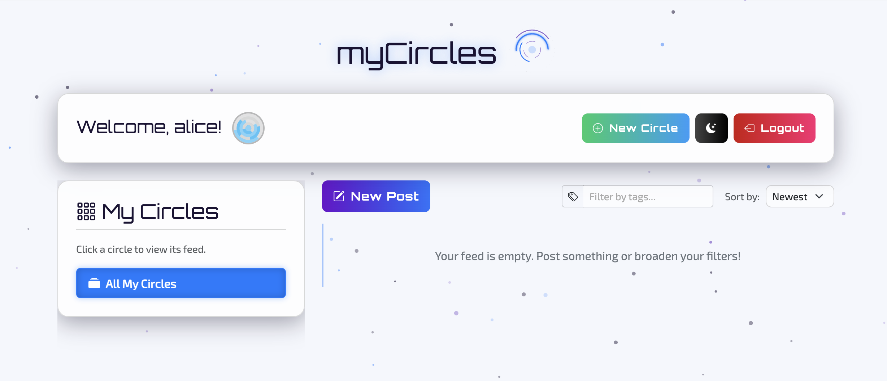

# mdb-circles

"Circles"distinct, user-created spaces for contextual sharing.



---

## Beyond the Feed: It's Time to Bring Back Social Circles

**Social media is broken. Instead of one giant feed, we need spaces built for the real relationships in our lives.**

-----

Let's be honest: posting online has become exhausting. We're trapped between the chaotic public square of the main feed and the isolated silo of a direct message. Every post requires a calculation. Is this too personal for my coworkers? Too boring for my college friends? Too niche for my family?

This feeling has a name: **context collapse**. It's the flattening of all our distinct social groups into a single, faceless audience. It forces us to perform a generic version of ourselves, and it's burning us out.

There has to be a better way. What if our platforms were built on a truth we all know intuitively? **We don't have one social life; we have many.** It's time to build software that gets that.

-----

### The Vision: From a Single Feed to Many Circles

Circles represents a shift from the monolithic feed to a community-centric model. Instead of broadcasting to everyone, users create and join distinct spaces for contextual sharing. Imagine:

  * **Share with Precision.** Post your vacation photo album in your "Family" circle. Create a collaborative wishlist in a "Secret Santa" circle with friends. Talk shop in a "Dev Team" circle with colleagues. No more self-censorship or awkward oversharing.
  * **Kill the Social Anxiety.** When you know exactly who you're talking to, the pressure to maintain a single, perfectly curated persona dissolves. You can be your authentic self in each of your social contexts.
  * **Build Real Communities.** This model shifts the focus from passively collecting followers to actively building or joining spaces you care about. It's a move from broadcasting to belonging.

This isn't just a concept; it's a design principle baked directly into our API's architecture. Good code doesn't just work—it expresses the core beliefs of the product.

-----

## The Blueprint: How Philosophy Meets the Code

The Circles API is built on a modern, high-performance, and scalable foundation designed to bring this vision to life.

**Core Technology Stack:**

  * **FastAPI**: A high-performance Python web framework for building APIs.
  * **MongoDB**: A flexible, document-oriented database ideal for social data.
  * **Pydantic**: For robust data validation, serialization, and settings management.
  * **JWT**: For secure, stateless user authentication and authorization.
  * **OpenAI API**: To power intelligent, AI-driven features.
  * **Cloudinary**: For cloud-based image storage, optimization, and management.

### The NoSQL Data Model: A Strategic Choice

Our choice of MongoDB is a deliberate strategy to achieve both data integrity and raw speed. We do this by balancing two key techniques: referencing and embedding.

**1. Referencing (The `users` Collection)**
For core entities like users, we use **referencing**. Each user has a single document. Other documents, like posts or comments, refer to this user via their `ObjectId`.

```json
// Example User Document
{
  "_id": ObjectId("..."),
  "username": "alice",
  "password_hash": "$2b$12$..."
}
```

**The Payoff:** This is clean and scalable. If a user changes their username, we only update it in one place (though for performance, we may denormalize it elsewhere).

**2. Embedding (The `circles` Collection)**
For data that is tightly coupled, we **embed** it directly. A user's role (e.g., admin, moderator) only exists *inside* a specific circle, so that's where we store it.

```json
// Example Circle Document with Embedded Members
{
  "_id": ObjectId("..."),
  "name": "Photography Enthusiasts",
  "owner_id": ObjectId("user_alice"),
  "members": [
    { "user_id": ObjectId("user_alice"), "username": "alice", "role": "admin" },
    { "user_id": ObjectId("user_bob"), "username": "bob", "role": "moderator" },
    { "user_id": ObjectId("user_charlie"), "username": "charlie", "role": "member" }
  ]
}
```

**The Payoff:** Blazing-fast reads. A single query retrieves a circle and its complete member list, eliminating the need for database joins.

**3. Denormalization & Flexibility (The `posts` Collection)**
For feed generation, speed is everything. Here, we use **denormalization**—strategically duplicating data—and embrace MongoDB's flexible schema to store varied post types in a single collection.

```json
// Example "Image" Post Document
{
  "_id": ObjectId("..."),
  "circle_id": ObjectId("circle_photography"),
  "author_id": ObjectId("user_bob"),
  "author_username": "bob", // Duplicated for speed
  "created_at": ISODate("..."),
  "content": {
    "post_type": "image",
    "text": "Captured this during golden hour!",
    "image_data": {
      "url": "https://res.cloudinary.com/...",
      "public_id": "...",
      "height": 800,
      "width": 1200
    },
    "tags": ["photography", "goldenhour"]
  },
  "comment_count": 0
}
```

**The Payoff:** Instant feed loading and feature flexibility. By copying `author_username`, we avoid extra lookups. By using a generic `content` object, we can store polls, wishlists, playlists, images, and more in the same collection without schema migrations.

-----

### Advanced Features in Action

With this solid data foundation, we can build powerful features that feel seamless.

#### 1\. Rich, Flexible Post Types

Circles isn't just for text. The API supports a variety of structured content types, including **standard posts, polls, collaborative YouTube playlists, wishlists, and image galleries**. The backend can even automatically detect image links in standard posts, upload them to Cloudinary, and convert the post to a rich `image` type.

```python
# From the PostCreate Pydantic model
class PostTypeEnum(str, Enum):
    standard = "standard"
    yt_playlist = "yt-playlist"
    poll = "poll"
    wishlist = "wishlist"
    image = "image"
```

#### 2\. AI-Powered Content Creation

To make creating engaging content effortless, we integrated the OpenAI API. A user can type a simple phrase ("a poll about the best lens for portraits, 50mm or 85mm"), and the API transforms it into a structured poll object, which is then validated by Pydantic.

```python
# From the POST /utils/generate-poll-from-text endpoint
response = openai.chat.completions.create(
    model="gpt-4o-mini",
    messages=[
        {"role": "system", "content": system_prompt},
        {"role": "user", "content": request.text}
    ],
    response_format={"type": "json_object"}
)
poll_json = json.loads(response.choices[0].message.content)
# Pydantic handles the validation of the AI's output
return PollData(**poll_json)
```

#### 3\. Advanced Role-Based Permissions

Secure, granular permissions are crucial. We use a three-tiered role system (`Admin`, `Moderator`, `Member`) and FastAPI's **Dependency Injection** to create a reusable "bouncer" that checks permissions before an endpoint's logic ever runs. This keeps our code clean, secure, and easy to reason about.

```python
# A reusable dependency to check membership and get a user's role
async def get_circle_and_user_role(circle_id: str, current_user: UserInDB) -> tuple[dict, RoleEnum]:
    # ... logic to find circle and user's role ...
    # Raises HTTPException with status 403 if not a member.
    return circle, RoleEnum(member_info['role'])

# In the endpoint, the check runs automatically.
@app.patch("/circles/{circle_id}/members/{user_id}")
async def update_circle_member_role(
    # This dependency acts as a gatekeeper
    circle_and_role: tuple = Depends(get_circle_and_user_role),
    ...
):
    circle, user_role = circle_and_role
    # If the code reaches here, the user is a verified member.
    # Now, we check if their role is high enough.
    if user_role == RoleEnum.moderator:
        # Moderators can only manage members, not other mods or admins.
        ...
```

#### 4\. Robust Invitation & Notification System

Communities grow through connection. The API provides two ways to bring people in: secure, single-use **invite links** and direct **username-based invitations**. When an invitation is sent, accepted, or rejected, the relevant users receive a real-time notification.

```python
# When an invitation is accepted...
await create_notification(
    user_id=invitation["inviter_id"],
    notification_type=NotificationTypeEnum.invite_accepted,
    content={
        "circle_id": str(circle["_id"]),
        "circle_name": circle["name"],
        "invitee_username": current_user.username
    }
)
```

#### 5\. Real-Time Awareness with Activity Status

To keep the user experience dynamic without constant reloading, a dedicated `/users/me/activity-status` endpoint allows the client to poll for changes since its last check. It efficiently reports new notifications, pending invitations, and even per-post new comment counts.

```python
# Example Response from GET /users/me/activity-status
{
  "new_server_timestamp": "2025-10-01T22:59:49.000Z",
  "new_comment_activity": [
    {
      "post_id": "678ab...",
      "new_comment_count": 3
    }
  ],
  "new_invites_count": 1,
  "new_notifications_count": 4
}
```

-----

### Performance at Scale

A social platform lives and dies by its performance. Our architecture is optimized for speed.

**MongoDB Aggregation Pipelines**
We use MongoDB's aggregation framework to perform complex data shaping and calculations directly within the database. Our feed generation pipeline calculates seen counts, poll results, comment counts, and fetches user data for "seen by" avatars—all in a single, efficient query.

```python
# A simplified view of the aggregation pipeline
def _get_posts_aggregation_pipeline(match_stage: dict, ..., current_user: UserInDB):
    pipeline = [
        match_stage,
        # Dynamically add fields like counts and user-specific states
        {"$addFields": {
            "is_seen_by_user": {"$in": [current_user.id, "$seen_by_details.user_id"]},
            "comment_count": {"$ifNull": ["$comment_count", 0]}
        }},
        # Calculate poll results on-the-fly for the requesting user
        {"$addFields": {
            "poll_results": {
                "$cond": {
                    "if": {"$eq": ["$content.post_type", "poll"]},
                    "then": { /* ... complex logic to calculate votes ... */ },
                    "else": "$$REMOVE"
                }
            }
        }},
        # ... additional stages for lookups, sorting, and pagination
    ]
    return pipeline
```

**Strategic Database Indexing**
Proper indexing is non-negotiable. At application startup, we programmatically ensure that indexes exist on all critical query paths to guarantee fast lookups. This includes TTL (Time-To-Live) indexes that automatically purge expired documents like invitation tokens.

```python
# From the lifespan context manager, running at startup
from pymongo import ASCENDING, DESCENDING, IndexModel

@asynccontextmanager
async def lifespan(app: FastAPI):
    # Ensures fast lookups for logins
    users_collection.create_index([("username", ASCENDING)], unique=True)
    # Critical for fetching a circle's feed or user's main feed
    posts_collection.create_index([("circle_id", ASCENDING), ("created_at", DESCENDING)])
    # Speeds up filtering posts by tags
    posts_collection.create_index([("content.tags", ASCENDING)])
    # Speeds up fetching user notifications
    notifications_collection.create_index([("user_id", ASCENDING), ("created_at", DESCENDING)])
    # Partial index to ensure a user can only have one pending invite per circle
    invitations_collection.create_index(
        [("circle_id", ASCENDING), ("invitee_id", ASCENDING)],
        unique=True,
        partialFilterExpression={"status": "pending"}
    )
    # TTL index to automatically delete expired tokens
    invite_tokens_collection.create_index([("expires_at", ASCENDING)], expireAfterSeconds=0)
    print("Database indexes ensured.")
    yield
```

-----

### Conclusion: More Than an API, a Better Way to Connect

The Circles API is more than a collection of endpoints; it's a blueprint for building modern, community-centric social applications. By combining a thoughtful social philosophy with a robust technical architecture, we've created a backend that is scalable, feature-rich, and a pleasure to develop on.

The future of social media isn't another billion-user network. It's millions of thriving, context-rich communities. It's time we built the tools to support them.

-----

### Appendix: Core Pydantic Models

Key `...Out` models that define the primary data structures returned by the API.

```python
# A helper class to handle MongoDB's ObjectId is used for all `PyObjectId` fields
from pydantic import BaseModel, Field, ConfigDict, AnyHttpUrl
from datetime import datetime
from typing import Optional, Any, List

class RoleEnum(str, Enum):
    member = "member"
    moderator = "moderator"
    admin = "admin"

class CircleOut(BaseModel):
    id: PyObjectId = Field(alias="_id")
    name: str
    description: Optional[str]
    owner_id: PyObjectId
    member_count: int
    user_role: Optional[RoleEnum] = None
    model_config = ConfigDict(populate_by_name=True)

class PostOut(BaseModel):
    id: PyObjectId = Field(alias="_id")
    circle_id: PyObjectId
    circle_name: str
    author_id: PyObjectId
    author_username: str
    content: dict[str, Any]
    created_at: datetime
    seen_by_count: int = 0
    is_seen_by_user: bool = False
    poll_results: Optional[dict] = None
    seen_by_user_objects: Optional[List[dict]] = []
    comment_count: int = 0
    model_config = ConfigDict(populate_by_name=True)

class InvitationOut(BaseModel):
    id: PyObjectId = Field(alias="_id")
    circle_id: PyObjectId
    circle_name: str
    inviter_id: PyObjectId
    inviter_username: str
    created_at: datetime
    model_config = ConfigDict(populate_by_name=True)

class NotificationOut(BaseModel):
    id: PyObjectId = Field(alias="_id")
    type: str  # e.g., "invite_received", "new_comment"
    content: dict[str, Any]
    is_read: bool
    created_at: datetime
    model_config = ConfigDict(populate_by_name=True)
```


---

## Quick Deploy to Render

You can instantly deploy your own running instance of the **mdb-circles** API server directly from this public repository to **Render** using the button below.

This is the fastest way to get your server running on a live, scalable cloud platform.

[](https://render.com/deploy?repo=https://github.com/ranfysvalle02/mdb-circles)

### Prerequisites

1.  A **Render** account.
2.  A **MongoDB Atlas** connection string, as the service requires a database.
3.  A **Cloudinary** account (optional, for full image-upload feature).

### Environment Variables

The deployment will require the following environment variables to be set in the Render dashboard. These are crucial for the API's security and functionality:

| Variable Name | Description | Required |
| :--- | :--- | :--- |
| **MONGO\_URI** | Your connection string for the MongoDB Atlas database. | **Yes** |
| **JWT\_SECRET** | A long, complex string used to sign user authentication tokens. | **Yes** |
| **OPENAI\_API\_KEY** | The key for the AI-powered content creation feature. | **Yes** |
| **CLOUDINARY\_CLOUD\_NAME** | Your Cloudinary Cloud Name for image hosting. | No (Optional) |
| **CLOUDINARY\_API\_KEY** | Your Cloudinary API Key. | No (Optional) |
| **CLOUDINARY\_API\_SECRET** | Your Cloudinary API Secret. | No (Optional) |
| **ENVIRONMENT** | Set to `production` to ensure proper logging and security headers. | No (Recommended) |

-----

## Appendix: A Manifesto for Humane Notifications in a World of Circles

The "Circles" model doesn't just fix the feed; it provides the perfect foundation for a notification system that respects users' time, attention, and mental well-being. Instead of a single, chaotic firehose of alerts, we can build a system based on **intention** and **context**.

### Guiding Principles

1.  **Control Belongs to the User:** The user, not the platform, decides what is important.
2.  **Context is Everything:** A notification's urgency is defined by the Circle it comes from.
3.  **Calm Over Compulsion:** Inform, don't interrupt. Provide value without demanding immediate action.
4.  **Clarity Over Curiosity:** Give the user everything they need to know directly in the notification.

### Humane Notification Features Enabled by Circles

#### 1\. Circle-Level Notification Controls

This is the cornerstone. Forget generic on/off toggles. Users set their preferences on a per-circle basis.

  * **"Family" Circle:** Immediate push notifications for all new posts and comments. This is my inner circle, and I want to know what's happening.
  * **"Work Projects" Circle:** Push notifications for @-mentions only. All other activity is bundled into a daily digest. I need to be reachable, but not constantly distracted.
  * **"Local Hiking Club" Circle:** All notifications are off. Activity appears as a "passive" update on the app's home screen. This is a low-priority interest, and I'll catch up when I have time.

#### 2\. The Multi-Circle Digest

Instead of a single, generic digest, users can schedule multiple, context-aware summaries.

  * **The Morning Briefing (8:00 AM):** "Here's what happened overnight in your 'Work Projects' and 'Side Hustle' circles."
  * **The Evening Roundup (7:00 PM):** "Catch up on your 'Book Club' and 'Hiking Club' circles from today."
  * **Real-time Alerts:** The "Family" circle bypasses the digest entirely, preserving its high-priority status.

#### 3\. The "Attention Budget"

Users can set a "budget" for how many push notifications they're willing to receive from lower-priority circles per day.

  * **Example:** "Allow up to 5 notifications per day from my 'Gaming Friends' circle." The system then uses its own logic to send only the most important ones (e.g., direct mentions, poll results you voted in) to stay within that budget. This respects the user's attention as a finite resource.

#### 4\. Ambient Activity & The "Info Shelf"

The `activity-status` endpoint powers a calmer way to stay informed.

  * **The Quiet Badge:** Instead of a red dot with a number, the app icon might show a subtle glow or a small, abstract shape indicating new activity. There's something new, but it's not screaming for your attention.
  * **The Dashboard:** Inside the app, each Circle icon shows a quiet summary of what's new ("3 new posts," "New poll results") so the user can choose where to direct their attention, rather than being led by a notification.

#### 5\. AI-Powered Summaries for Busy Circles

For extremely active circles, a simple notification count is still noise. We can leverage our OpenAI integration to provide true insight.

  * **Instead of:** "25 new messages in 'Event Planning'."
  * **You get:** "Activity in 'Event Planning' is high. The main topic is a debate about the venue, with 'The Grand Hall' being the current favorite. Also, Sarah is asking for everyone's dietary restrictions."

By building these humane features on top of the Circles architecture, we create a product that is not only more organized but fundamentally more respectful of its users. We move from a system designed to maximize engagement to one designed to foster meaningful, calm, and intentional connection.
